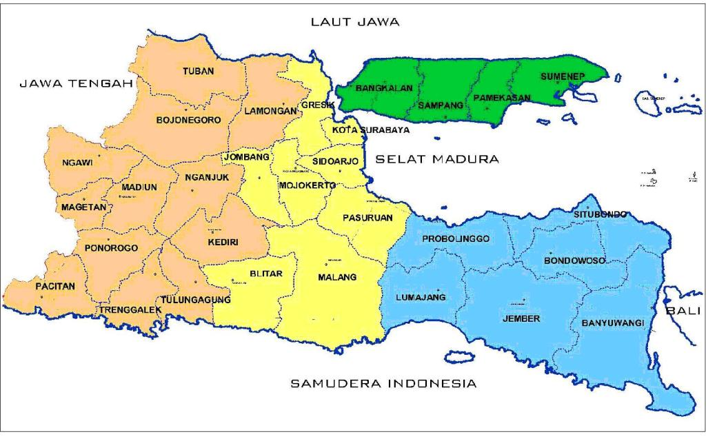

```{r setup, include=FALSE}
# clean up the environment
rm(list = ls())

# setup chunk options
knitr::opts_chunk$set(
  message = FALSE,
  warning = FALSE,
  cache = TRUE,
  fig.align = "center",
  comment = "#>"
)

options(scipen = 9999)
```

# Library

```{r}
# pengolahan dataframe
library(dplyr)
library(tidyr)
library(lubridate)

# visualisasi
library(ggcorrplot)
library(gplots)
library(ggplot2)
library(plotly)
library(foreign)
library(stringr) 
library(glue)

# analisis
library(plm)
library(lfe)
library(lmtest)
library(car)
library(tseries)
library(MLmetrics)
```

# Case Study: Analisis Pengaruh Tingkat Kemiskinan di Provinsi Jawa Timur dengan Data Panel 

## Data Preparation

```{r}
df <- read.csv('data_input/df_final_updated.csv')
head(df)
```
```{r}
glimpse(df)
```

Deskripsi Data:

  + `Kabupaten` : informasi nama kabupaten di Jawa Timur
  + `Year` : informasi tahun
  + `persentase_kemiskinan`: [persentase penduduk miskin tiap kabupaten/kota](https://jatim.beta.bps.go.id/id/statistics-table/1/MjI5MCMx/garis-kemiskinan-jumlah-dan-persentase-penduduk-miskin-di-jawa-timur-2011-2021.html)
  + `rls`: [rata-rata lama sekolah tiap kabupaten/kota](https://jatim.bps.go.id/statictable/2023/07/26/3050/-rata-rata-lama-sekolah-menurut-kabupaten-kota-di-provinsi-jawa-timur-tahun-2017-2022.html)
  + `keluhan_kesehatan`: [persentase penduduk yang mempunyai keluhan kesehatan selama sebulan terakhir](https://jatim.bps.go.id/statictable/2023/07/24/3000/persentase-penduduk-yang-mempunyai-keluhan-kesehatan-selama-sebulan-terakhir-menurut-kabupaten-kota-di-provinsi-jawa-timur-2018-2022.html)
  + `tpt`: [Tingkat Pengangguran Terbuka (TPT)](https://surakartakota.bps.go.id/indicator/6/152/1/tingkat-pengangguran-terbuka-tpt-.html)
  + `kejahatan`: [jumlah kejahatan yang dilaporkan menurut Kepolisian Resort ](https://jatim.bps.go.id/statictable/2023/07/25/3021/kriminalitas---jumlah-kejahatan-yang-dilaporkan-menurut-kepolisian-resort-di-provinsi-jawa-timur-2019-2022.html)
  + `puskesmas`: [jumlah puskesmas](https://jatim.beta.bps.go.id/id/statistics-table/1/Mjk3OSMx/-jumlah-puskesmas-puskesmas-rawat-inap-puskesmas-non-rawat-inap-menurut-kabupaten-kota-di-provinsi-jawa-timur-2021-dan-2022.html)

## Check Balancing Data

**1. Melihat frekuensi data berdasarkan index individu**

```{r}
table(df$Kabupaten)
```

**2. Menggunakan `is.pbalanced()` **


The data are balanced if each individual has the same time periods and the output is `TRUE`. 

```{r}
is.pbalanced(df, # data
             index = c('Kabupaten', 'Tahun')) # indeks variabel
```


### Data Format adjustments

**1. Membuat Panel Data Frame**

```{r}
#membuat pdata.frame
df_panel <- df %>% pdata.frame(index = c('Kabupaten', 'Tahun'))

#memeriksa struktur data
glimpse(df_panel)
```

**2. Memeriksa Dimensi Data**

```{r}
pdim(df_panel)
```


## Pemeriksaan Missing Value

```{r}
colSums(is.na(df_panel))
```

## Exploratory Data Analysis

### Ringkasan Data

```{r}
summary(df_panel)
```


### Hubungan Antar Variabel

```{r}
df_panel %>% 
  select(-c(Kabupaten, Tahun)) %>% 
  cor() %>% 
  ggcorrplot(type='lower', lab=TRUE)
```

```{r}
df %>% 
  select(-c(Kabupaten, Tahun)) %>% 
  cor() %>% 
  ggcorrplot(type='lower', lab=TRUE)
```

### Explorasi Socio demografi

Ada cukup banyak kabupaten dan kota di Provinsi Jawa Timur. Daerah Jawa Timur akan dibagi berdasarkan [*tlatah*](https://www.goodnewsfromindonesia.id/2016/12/27/ini-keunikan-yang-hanya-dimiliki-masyarakat-jawa-timur#:~:text=Wilayah%20ini%20mencangkup%20daerah%2Ddaerah,Kabupaten%20Tuban%2C%20Kabupaten%20Lamongan%2C%20dan), yang artinya adalah kelompok masyarakat dengan ciri budaya yang sama, dan berasal dari satu sumber budaya yang sama untuk keperluan visualisasi. 

Budayawan Universitas Jember, Ayu Sutarto (2004) mengatakan, wilayah Jatim terbagi ke dalam sepuluh tlatah atau kawasan kebudayaan. Tlatah kebudayaan besar ada empat, yakni Mataraman (bagian Barat), Arek (bagian Tengah), Madura Pulau (bagian Utara), dan Pandalungan (bagian Timur). Tlatah Mataraman pada bagian Barat cukup besar sehingga visualisasi coplot akan dibagi dua.

```{r, out.width = "100%", echo = FALSE, fig.align = "center"}

```

```{r}
# memisah kata pertama dan kedua untuk nama tiap Daerah
Kabupaten_str = "Kabupaten"
df <- df %>% 
  mutate(
    Daerah = glue(
      "{word(Kabupaten, 1)}
       {word(Kabupaten, -1)}"
    )
  ) %>% 
  mutate(
    Daerah_simplified = glue(
      "{ifelse(word(Kabupaten, 1) == Kabupaten_str, word(Kabupaten, -1), Kabupaten)}"
    )
  )

# pengelompokan daerah berdasarkan Tlatah
Utara <- df %>% 
          filter(Kabupaten %in% c('Kabupaten Bangkalan', 'Kabupaten Sampang', 
                                  'Kabupaten Pamekasan', 'Kabupaten Sumenep')) %>% 
          droplevels()

Barat <- df %>% 
          filter(Kabupaten %in% c('Kabupaten Tuban', 'Kabupaten Lamongan', 'Kabupaten Bojonegoro', 
                                  'Kabupaten Ngawi', 'Kabupaten Madiun', 'Kabupaten Nganjuk', 'Kabupaten Magetan',
                                  'Kabupaten Pacitan', 'Kabupaten Kediri', 'Kabupaten Tulungagung', 
                                  'Kabupaten Blitar', 'Kabupaten Trenggalek', 'Kabupaten Ponorogo', 
                                  'Kota Blitar', 'Kota Kediri', 'Kota Madiun')) %>% 
          droplevels()

Barat_atas <- df %>% 
              filter(Kabupaten %in% c('Kabupaten Tuban', 'Kabupaten Lamongan', 'Kabupaten Bojonegoro', 
                                      'Kabupaten Ngawi', 'Kota Madiun', 'Kabupaten Madiun', 
                                      'Kabupaten Nganjuk', 'Kabupaten Magetan')) %>% 
              droplevels()

Barat_bawah <- df %>% 
                filter(Kabupaten %in% c('Kabupaten Pacitan', 'Kabupaten Kediri', 
                                        'Kota Kediri', 'Kabupaten Tulungagung', 'Kabupaten Blitar', 
                                        'Kota Blitar', 'Kabupaten Trenggalek', 'Kabupaten Ponorogo')) %>% 
                droplevels()

Tengah <- df %>% 
          filter(Kabupaten %in% c('Kabupaten Gresik', 'Kota Surabaya', 'Kabupaten Jombang', 
                                  'Kabupaten Mojokerto', 'Kabupaten Sidoarjo', 
                                  'Kabupaten Pasuruan', 'Kabupaten Blitar', 'Kabupaten Malang')) %>% 
          droplevels()

  
Timur <- df %>% 
          filter(Kabupaten %in% c('Kabupaten Probolinggo', 'Kabupaten Lumajang', 
                                  'Kabupaten Bondowoso', 'Kabupaten Jember', 
                                  'Kabupaten Situbondo', 'Kabupaten Banyuwangi')) %>% 
          droplevels()
```

#### Coplot 

```{r}
coplot(persentase_kemiskinan ~ Tahun|Kabupaten,
       type = "b",
       data = Utara,
       rows = 1,
       col = "darkblue",
       overlap = 0) 
```

> Dari coplot di atas, daerah Utara Jawa Timur memiliki persentase kemiskinan yang relatif sama, kecuali Kabupaten Pamekasan. Dibandingkan dengan Kabupaten Bangkalan, Sampang, dan Sumenep, persentase kemiskinan Kabupaten Pamekasan per tahunnya berkisar di angka 14 sampai 15 persen. Tiap Kabupaten di daerah ini persentase kemiskinannya meningkat di tahun 2021, bertepatan dengan munculnya pandemi covid secara luas. 

```{r}
coplot(persentase_kemiskinan ~ Tahun|Daerah,
       type = "b",
       data = Barat,
       rows = 1,
       col = "darkblue",
       overlap = 0) 
```


```{r}
coplot(persentase_kemiskinan ~ Tahun|Daerah,
       type = "b",
       data = Barat_atas,
       rows = 1,
       col = "darkblue",
       overlap = 0) 
```


```{r}
coplot(persentase_kemiskinan ~ Tahun|Daerah,
       type = "b",
       data = Barat_bawah,
       rows = 1,
       col = "darkblue",
       overlap = 0) 
```

```{r}
coplot(persentase_kemiskinan ~ Tahun|Daerah,
       type = "b",
       data = Tengah,
       rows = 1,
       col = "darkred",
       overlap = 0) 
```

```{r}
coplot(persentase_kemiskinan ~ Tahun|Kabupaten,
       type = "b",
       data = Timur,
       rows = 1,
       col = "darkblue",
       overlap = 0) 
```

### Heatmap persentase kemiskinan

cari data shp terus join di csv

### Heterogenitas Persentase Kemiskinan

**1. Heterogenitas antar Kabupaten/Kota**

```{r}
plotmeans( persentase_kemiskinan ~ Kabupaten, 
           data = df_panel, 
           main="Heterogenitas Persentase Kemiskinan antar Kabupaten/Kota")
```

    

**2. Heterogenitas antar Waktu**

```{r}
plotmeans( persentase_kemiskinan ~ Tahun, 
           data = df_panel, 
           main="Heterogenitas Persentase Kemiskinan antar Tahun")
```

## Cross-Validation

```{r}
#membuat data train
panel_train <- df_panel %>% filter(Tahun != 2022)

#membuat data test
panel_test <- df_panel %>% filter(Tahun %in% 2022)
```

setelah dilakukan cross validation kita perlu memastikan kembali bahwa data train sudah balance dengan melakukan balancing

```{r}
panel_train <- panel_train %>% 
  droplevels() %>%    # menghapus informasi waktu yang diambil sebagai data test (tahun 2022)
  make.pbalanced()    # melakukan balancing kembali
```


## Pemeriksaan Asumsi Multikolinieritas

```{r}
lm(formula=persentase_kemiskinan ~ .-Kabupaten - Tahun , data=panel_train) %>% 
  vif()
```

## Penentuan Model Estimasi

### Pembuatan Model

**Model Gabungan (Common Effect Model)**

```{r}
# menyimpan formula regresi data panel
formula_kemiskinan <- persentase_kemiskinan ~ rls + keluhan_kesehatan + tpt + kejahatan + puskesmas

# membuat Common effect model 
cem <- plm(formula_kemiskinan, 
           data = panel_train,
           index = c("Kabupaten","Tahun"),
           model = "pooling")

cem
```


**Model Pengaruh Tetap (Fixed Effect Model)**

```{r}
# membuat fixed effect model 
fem <- plm(formula_kemiskinan, 
           data = panel_train,
           index = c("Kabupaten","Tahun"),
           model = "within")

fem
```

**Uji Chow**

Memilih model terbaik antara Common Effect Model dengan Fixed Effect Model dapat menggunakan Uji Chow dengan fungsi `pooltest()`.

Hipotesis yang diuji:

- $H_0$ : Model gabungan/Common Effect Model
- $H_1$ : Model pengaruh tetap/Fixed Effect Model

$H_0$ ditolak jika P-value < α. Nilai α yang digunakan sebesar 5%.

```{r}
pooltest(cem,fem)
```
p-value (0.005365) < α (0.05) maka $H_0$ ditolak. 

Kesimpulan: Model terbaik untuk data persentase kemiskinan di Jawa Timur adalah **model Fixed Effect**.

Langkah selanjutnya yang akan dilakukan ketika model terbaik bertipe Fixed Effect adalah membuat model Random Effect.

**Model Pengaruh Acak (Random Effect Model)**

```{r}
rem <- plm(formula_kemiskinan, 
           data = panel_train,
           index = c("Kabupaten","Tahun"),
           model = "random")
rem
```

**Uji Hausman**

Pemilihan model terbaik antara Fixed Effect Model dengan Random Effect Model dapat menggunakan Uji Hausman dengan fungsi `phtest()`. Pada dasarnya test ini menguji apakah _unique errors/disturbance_ $u_{it}$ berkorelasi dengan regresi, hipotesis nolnya adalah tidak.

Hipotesis yang diuji:

- H0 : Model pengaruh acak/Random Effect Model
- H1 : Model pengaruh tetap/Fixed Effect Model

Tolak $H_0$ jika P-value < α. Nilai α yang digunakan sebesar 5%.

```{r}
phtest(rem,fem)
```
p-value (0.3308) > α (0.05) maka gagal tolak $H_0$. 

Kesimpulan: Model terbaik untuk data persentase kemiskinan di Jawa Timur adalah **model Random Effect**.

Langkah selanjutnya yang akan dilakukan ketika model terbaik bertipe Random Effect adalah uji Lagrange Multiplier.

**uji Lagrange Multiplier**

Uji LM memutuskan antara random effect model dan regresi OLS sederhana. Hipotesis nol dalam uji LM adalah varians antar entitas bernilai nol. Artinya, tidak ada perbedaan signifikan antar unit (yaitu tidak ada efek panel).

**Pemeriksaan Pengaruh Individu & Waktu**

Hipotesis yang diuji adalah sebagai berikut.

- H0 : Tidak ada pengaruh individu & waktu
- H1 : Ada pengaruh individu & waktu

```{r}
plmtest(rem, 
        effect = "twoways",
        type = "bp")
```

p-value (0.03074) > α (0.05) maka tolak $H_0$. 

Kesimpulan: Ada pengaruh individu & waktu. Sehingga perlu dipastikan:

**Pemeriksaan Pengaruh Individu**

Hipotesis yang diuji adalah sebagai berikut.

- H0 : Tidak ada pengaruh individu
- H1 : Ada pengaruh individu

**Pemeriksaan Pengaruh Waktu**

Hipotesis yang diuji adalah sebagai berikut.

- H0 : Tidak ada pengaruh waktu
- H1 : Ada pengaruh waktu

```{r}
plmtest(rem, 
        effect = "time",
        type = "bp")
```

```{r}
plmtest(rem, 
        effect = "individual",
        type = "bp")
```
Ada efek individu tapi tidak ada efek waktu. kalo misal gini, bera

```{r}
rem_ind <- plm(formula_kemiskinan, 
           data = panel_train,
           index = c("Kabupaten","Tahun"),
           model = "random",
           effect = "individual")
rem_ind
```

### Pengujian Asumsi

**Normalitas**

Model diharapkan menghasilkan **error yang berdistribusi normal** dan error lebih banyak berkumpul di sekitar angka nol.

Hipotesis yang diuji:

- H0 : Sisaan menyebar normal
- H1 : Sisaan tidak menyebar normal

Tolak $H_0$ jika P-value < α. Nilai α yang digunakan sebesar 5%.
```{r}
# your code here
rem_ind$residuals %>% shapiro.test()
```
p-value (0.00036) < 0.05, maka tolak $H_0$.

Kesimpulan: residual/sisaan tidak menyebar normal.

**Homogenitas**

Diharapkan error yang dihasilkan oleh model menyebar secara acak atau dapat dikatakan **variasi konstan**.

Hipotesis yang diuji:

- H0 : Sisaan memiliki ragam homogen
- H1 : Sisaan tidak memiliki ragam homogen

H0 ditolak jika P-value < α. Nilai α yang digunakan sebesar 5%.

```{r}
# your code here
rem_ind %>% bptest()
```

p-value (0.0088) < 0.05, maka tolak $H_0$.

Kesimpulan:  residual/sisaan tidak memiliki ragam homogen.

**Autokorelasi**

Hipotesis yang diuji:

- H0 : tidak terjadi autokorelasi pada sisaan
- H1 : terjadi autokorelasi pada sisaan

Tolak $H_0$ jika P-value < α. Nilai α yang digunakan sebesar 5%.

```{r}
rem_ind$residuals %>% Box.test(type = "Ljung-Box")
```

p-value (0.2291) > 0.05, maka gagal tolak $H_0$. 

Kesimpulan: tidak ada autokorelasi pada residual/sisaan.


## Interpretasi Model

**1. Koefisien**
```{r}
summary(rem_ind)
```

Interpretasi:

- Variabel yang signifikan mempengaruhi persentase kemiskinan masyarakat Jawa Timur di tahun 2019 - 2022 adalah:
  + Rata-rata lama sekolah (rls)
  + Persentase penduduk yang mempunyai keluhan kesehatan selama sebulan terakhir (keluhan_kesehatan)
  + Tingkat pengangguran terbuka (tpt)

- persentase kemiskinan masyarakat di suatu kabupaten/kota di Jawa Timur akan berkurang sebesar 1.0767 untuk setiap kenaikan 1 satuan rerata lama sekolah (rls), dengan catatan variabel lainnya bernilai tetap.

- persentase kemiskinan masyarakat di suatu kabupaten/kota di Jawa Timur akan bertambah sebesar 0.2997 untuk setiap kenaikan 1 satuan tingkat pengangguran terbuka (tpt), dengan catatan variabel lainnya bernilai tetap.
  
**2. Mengekstrak informasi Efek dari model Random**

Untuk mengekstrak informasi efek dari model FEM kita dapat menggunakan fungsi `fixef(model fem, effect="twoways")`,
```{r}
ranef(rem_ind)
```
Interpretasi:

- persentase kemiskinan masyarakat di Kota Surabaya adalah sebesar -2.525 apabila tidak terdapat informasi lainnya
- persentase kemiskinan masyarakat di Kabupaten Probolinggo adalah sebesar nilai intercept + 6.170 apabila tidak terdapat informasi lainnya

Formula model:

$$y_{it} = \beta_0+\beta _{1t}*x_{1t}+u_{it}$$

$$y_{Surabaya} = 20.26 -1.077*rls -0.034 * keluhan \ kesehatan + 0.299 * tpt + 0.0002*kejahatan -0.052 * puskesmas -2.52$$
Interpretasi:

- Persentase kemiskinan di Jawa Timur tanpa ada variabel prediktor adalah sebesar 20.26 persen.

- Persentase kemiskinan di Surabaya tanpa ada variabel prediktor adalah sebesar 20.26 - 2.52 = 17.74 persen.

## Prediksi & Evaluasi

```{r}
# your code here
pred <- predict(rem_ind, # model akhir
                panel_test, # data test
                na.fill = F)
pred
```

Untuk menguji apakah model yang kita miliki sudah baik dalam memprediksi data baru maka kita akan evaluasi dengan menggunakan nilai error, salah satu metric eror yang biasa digunakan adalah MAPE. Kita dapat melakukannya menggunakan fungsi `MAPE()` dengan parameter:

- y_pred =  nilai hasil prediksi
- y_true =  nilai target asli

```{r}
# your code here
MAPE(y_pred = pred,
     y_true = panel_test$persentase_kemiskinan)
```

> Insight: tingkat kesalahan prediski model fem dalam memprediksi nilai baru adalah sebesar 34.56%. Angka sekian cukup besar jika kita bandingkan dengan _industry standard threshold_, yaitu di bawah 10%, sehingga model kurang baik dalam memprediksi data yang baru. Namun, 

## Kesimpulan dan Saran

## Referensi

- https://www.princeton.edu/~otorres/Panel101R.pdf

